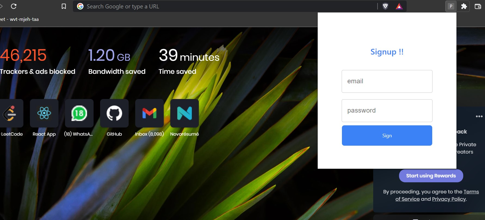
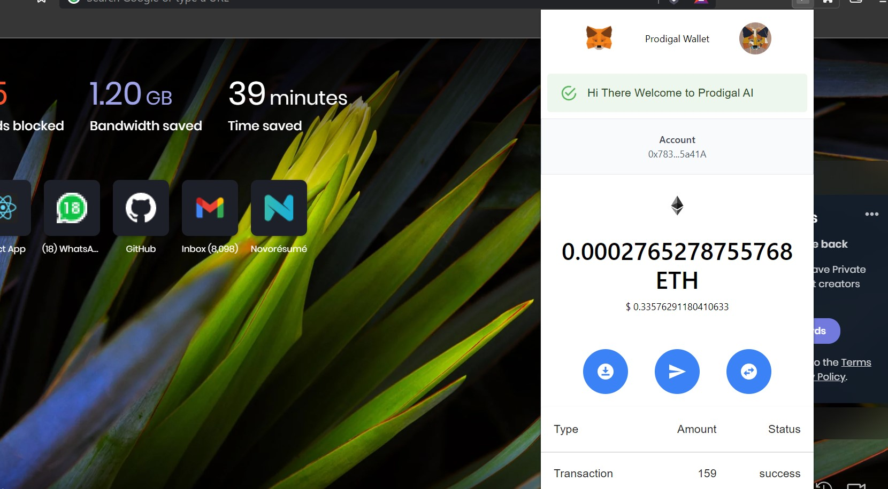
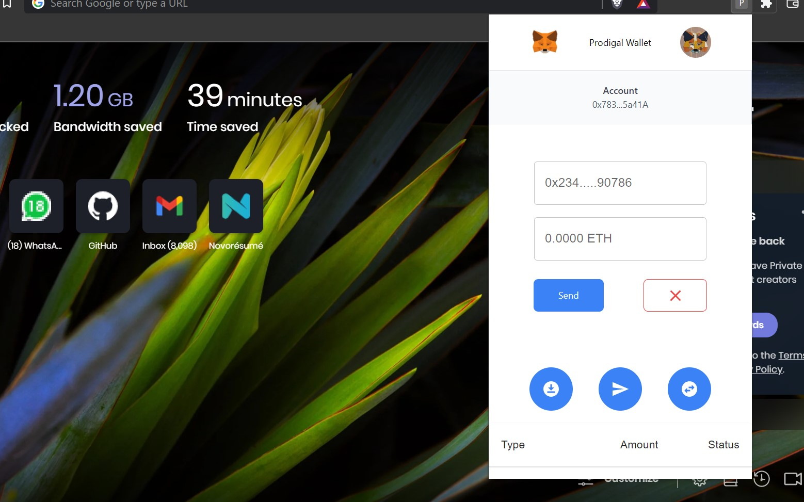

# 🤑 Etherium Wallet


### About Project
Prodigal wallet is an app that allows cryptocurrency users to store and retrieve their digital assets.<br>
It is a Crypto wallet that allows users to store and swap cryptocurrencies, interact with the Ethereum blockchain ecosystem, and host a growing array of decentralized applications (dApps).<br><br>
### Installation
Can directly modify package.json file for adding more options

```react 
git clone --URL
npm install
npm start
```

## Usage
This project is very useful if you want to use other wallet then the metamask 🤣🤣. Just kidding here you can create multiple wallets which can be diverse. We can send and recieve tokens to the personal level which is very usefull.
Some of its advantages are

- ### Easy to get started
A key advantage of investing in Bitcoin and other digital currencies is that it is easy to get started. The application process to open up a wallet and account can take just a matter of minutes. Once the account is opened, you will be able to start purchasing these coins immediately after a deposit is made. This is very quick compared to investing in a stock or other investments through traditional brokerage accounts.

- ### Security for account and transactions
The overall security of a cryptocurrency wallet is something that all people need to take seriously. When you invest your money into a digital coin, you will want to know that it is protected and encrypted. Through a digital and crypto wallet, you will know that your data, information, and access to your investment are properly protected. There will be a very secure sign in process that will require you to provide a dedicated password and user ID that is encrypted. This can help to ensure that people are not able to access your account unless you want them to be able to do so. You are also able to complete a variety of transactions privately and securely without concern that other parties will be able to see your transaction and other data.

- ### Complete transaction to buy or sell products
You should also consider using a crypto wallet because it can be used to complete transactions. While many consider Bitcoin and other digital currencies to be a form of investment, they are also a form of currency that can be used to purchase goods and services from people all over the world. When you have a wallet, you will be able to send money to anyone else in the world at any time of the day. This can be a great way to complete a purchase or it can be done to swap coins with other individuals.

- ### Immutable in Nature
All the transactions are very safe as compared to normal wallets


## Login
Can use sample credentials for testing as 
```bash
email : sidharth@gmail.com
password : 12345
```
Here the user will have sample tokens to send from one place to other. He can transgfer these tokens to his/her wallet as well. 
<blockquote>Note this are Rinkeby Tokens. Please do not misinterpret by mainnet this is testnet server</blockquote>
<br>
 
<br>

## Signup
User can simply create account which will be stored in decentralized Database.
<blockquote>As of now the database that i have used is not decentralised but will use it in future as the app grows</blockquote>
<br>
 
<br>
<blockquote>But All the transactions are powered by Web3 which makes it highly secure</blockquote>

### Main Page
After successfull authentification the user will be redirected to the main page of the wallet. 
Here the user can perform these operations
- Send Ether from one account to the other account
- Your Eth Value will be converted into Dollars
- Wallet Balance is shown
- Token Swap project is also created so check it out on <link>https://prodigal-swap.vercel.app/<link>
- Wallet Address can be copied on clicking the wallet address link
- <blockquote>As this is test Project so Ether can be entered through Rinkeby Faucet</blockquote>

<br>
 
<br>

### For Sending Ether
Click on the middle section to send transaction to the other user

 
<br>

### Creating the Transaction
After successfully adding the wallet address and the amount the user can send it to the reciever specifying the gas fees. Gas fees is default set at 100. User can change it accordingly
<br>
<br>
 
<br>

## Wohoo!! Successful Transaction!!
<blockquote>Now transaction will be successfull and will generate transaction hash to check on etherscan. 👏👏👏</blockquote>
All check are performed accordingly🙌🙌
<br>
<br>
<br>
## I will not mind if you send ETH to my wallet Address😁😁

```bash
Wallet Address: "0x0cc4C0722F4222aebd35BceaB8465dBDA43e0d03"
```


